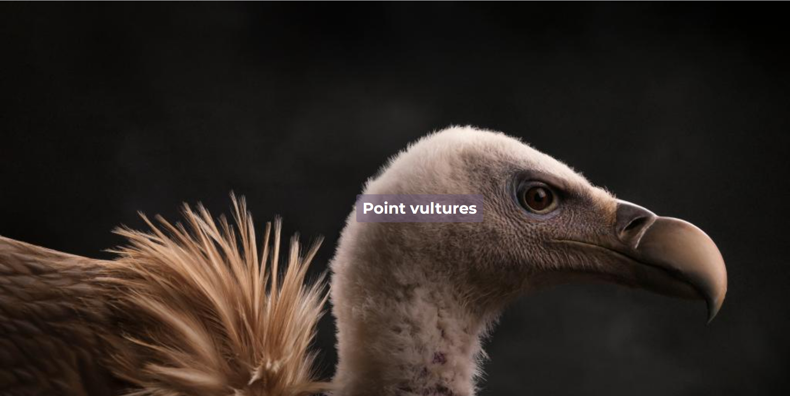
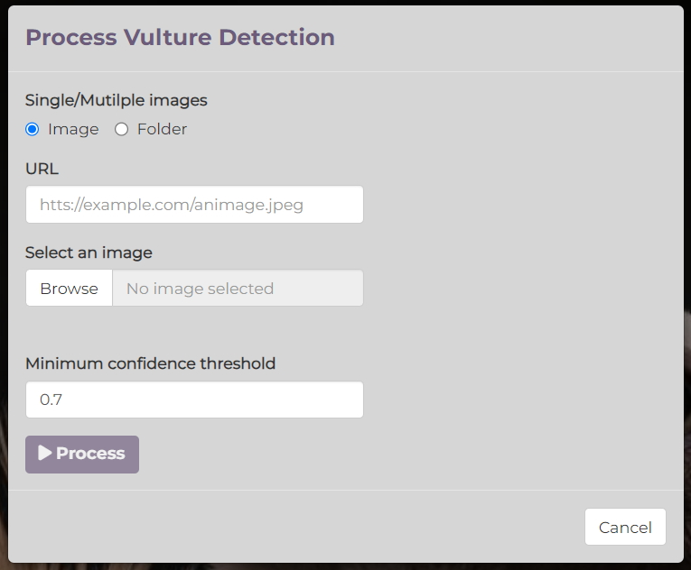
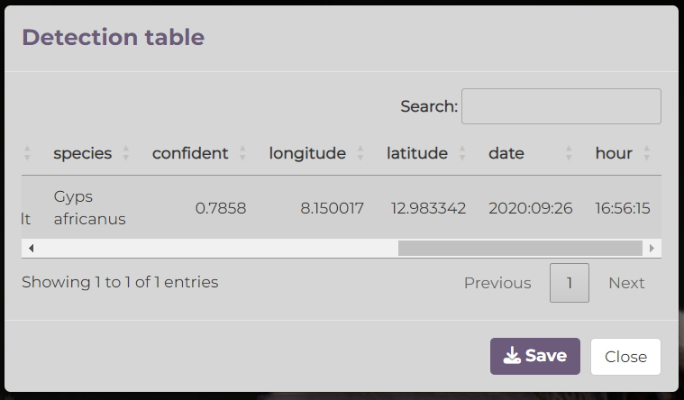

# Wildfier
Wildfier is deep learning based application to detect, segment and count wildlife 
species on images or video. At this stage, it includes an example of White-backed Vulture (_Gyps africanus_) detection model. It gives way to get a detection table including species name and metadata (date, hour, longitude, latitude, etc.) from image. The metadata are extracted only if available in the images the detection is applied on.

# Get started
To use Wildfier, clone current [app repository](https://github.com/stangandaho/wildfier). Open you terminal, type and enter:
```
git clone https://github.com/stangandaho/wildfier.git
```
Or [download](https://github.com/stangandaho/wildfier/archive/refs/heads/main.zip) and unzip the repository. Go to _wildfier_ folder and click on _wildfier.Rproj_. Make sure you have [R and RStudio](https://posit.co/download/rstudio-desktop/) installed. To run the app, open _ui.R_ or _server.R_ file and click on __Run App__ button.


⚠ If you launch the application for the first time, it can take some second to load the necessaries dependencies. Make sure you are connected to internet, because some python modules are required.

Once loaded, the app main interface look like this:
. 

To process to detection, click on *Point vultures* button. It open a modal as bellow to provide some arguments like images (to select locally or provide an URL or folder path for multiple images processing).  



By default, the minimum confidence threshold for detections is 0.7. Objects detected with confidence below this threshold will be disregarded. Adjusting this value can help reduce false positives (detect falsely vulture on images).

If detection is done on provided image, you will be able do download the detection table that includes the original and detection image paths, the confident threshold of detection and complementary information if available in the metadata of the provided image like bellow.


